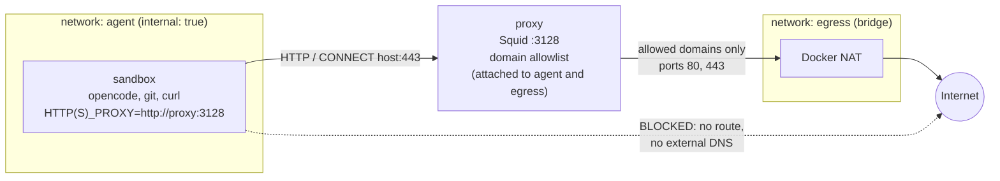
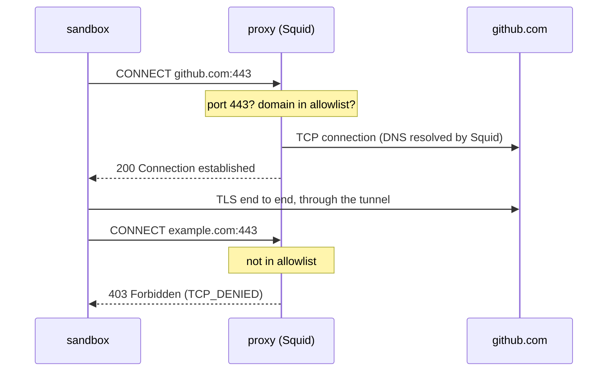

# Networking: outbound traffic control

The `sandbox` container has no route to the Internet. Its only way out is the Squid `proxy` service, which allows requests to the domains listed in [squid/allowed-domains.txt](../squid/allowed-domains.txt) and denies everything else.

## Topology



| Network  | Docker option     | Members            | Role |
|----------|-------------------|--------------------|------|
| `agent`  | [`internal: true`](https://docs.docker.com/reference/cli/docker/network/create/#options) | `sandbox`, `proxy` | Isolated network: no gateway to the outside, Docker DNS resolves service names only (`proxy`). |
| `egress` | standard bridge   | `proxy`            | Gives the proxy its outbound route to the Internet. |

`proxy` is the only container attached to both networks, so it is the only path between the sandbox and the Internet.

## How a request goes out

Tools in the sandbox (opencode, `git`, `curl`, npm…) pick up the proxy from the environment set in [compose.yaml](../compose.yaml): `HTTP_PROXY`, `HTTPS_PROXY` (and their lowercase forms), `NO_PROXY=localhost,127.0.0.1,proxy`, and `NODE_USE_ENV_PROXY=1` for Node.js-based tools.



- **HTTPS** goes through a `CONNECT` tunnel. Squid only sees the target host and port, then relays the encrypted stream: there is no TLS interception, so no certificate to install in the sandbox and no visibility on the content.
- **Plain HTTP** (port 80) is forwarded by Squid itself, with the same domain check.
- **DNS** is resolved by Squid, not by the sandbox. The sandbox cannot resolve external names at all, which also rules out DNS-based exfiltration.
- A tool that ignores the proxy variables does not bypass the filter: it simply fails to connect.

## Filtering rules

Defined in [squid/squid.conf](../squid/squid.conf), evaluated in order, first match wins:

| Rule | Effect |
|------|--------|
| `deny !Safe_ports` | Only ports 80 and 443 (no SSH on 22, no arbitrary ports). |
| `deny CONNECT !SSL_ports` | Tunnels only to port 443. |
| `deny manager` | No access to Squid's management interface. |
| `allow localnet allowed_domains` | Clients from private networks (the `agent` network) to an allowed domain. |
| `deny all` | Everything else. |

The allowlist holds one domain per line; a leading dot also matches subdomains (`.github.com` matches `api.github.com`). After editing it, reload the proxy:

```bash
docker compose restart proxy
```

Other settings: no cache (filtering only), and the client IP is not forwarded (`forwarded_for delete`, `via off`).

## Observing traffic

Squid logs every request to the container's stdout:

```bash
docker compose logs -f proxy
```

```
... 172.24.0.2 TCP_TUNNEL/200 587709 CONNECT github.com:443 - HIER_DIRECT/140.82.121.3 -
... 172.24.0.2 TCP_DENIED/403 3358 CONNECT example.com:443 - HIER_NONE/- text/html
... 172.24.0.2 TCP_DENIED/403 3342 CONNECT github.com:22 - HIER_NONE/- text/html
```

`TCP_TUNNEL` / `TCP_MISS` means allowed, `TCP_DENIED` means blocked. A denied request shows up in the sandbox as `CONNECT tunnel failed, response 403` (HTTPS) or an HTTP 403 (plain HTTP).

## Limits

- Filtering is per domain, not per URL or content: everything reachable on an allowed domain is reachable by the agent, including uploads if it holds credentials for that service. Keep the allowlist short and do not give the sandbox credentials it does not need (it has no Git credentials by default; if you run `setup-github`, use a fine-grained token limited to the repositories you need).
- Secrets the agent uses (model provider API key, `opencode auth login` credentials, GitHub token from `setup-github`) live in the sandbox and can be read by the agent; the allowlist limits where they could be sent.
- The `localnet` ACL accepts any private source address. The proxy publishes no port on the host, so only containers attached to its networks (and the Docker host itself) can reach it.
