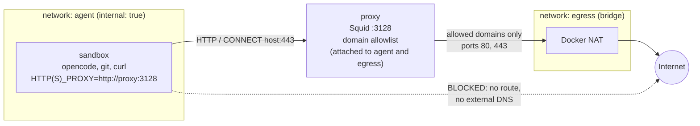
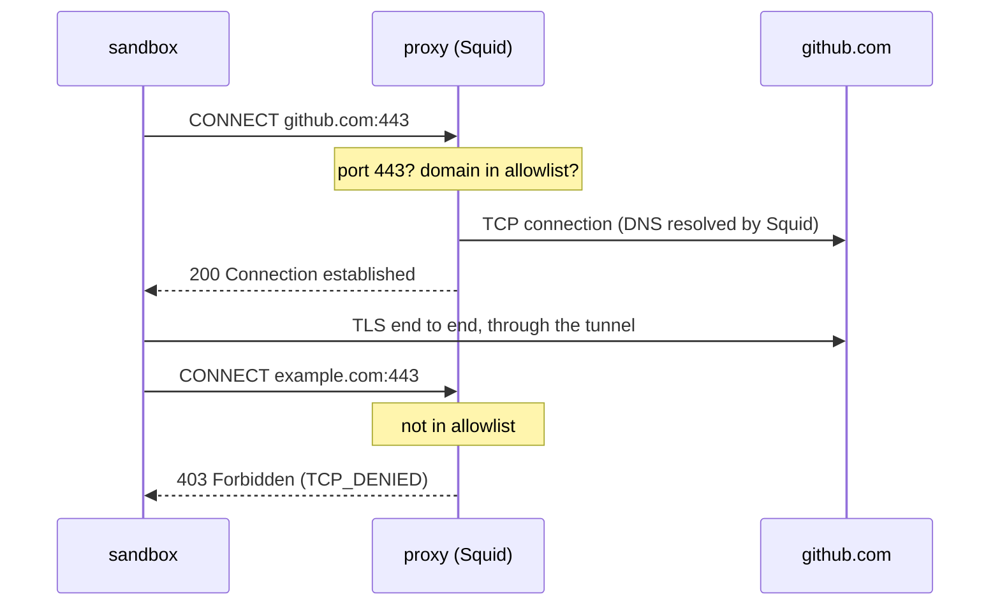
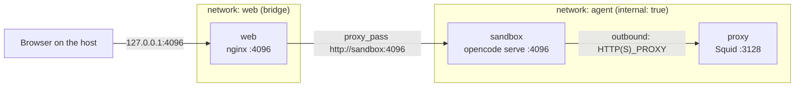

# Networking: outbound traffic control

The `sandbox` container has no route to the Internet. Its only way out is the Squid `proxy` service, which allows requests to the domains listed in [squid/allowed-domains.txt](../squid/allowed-domains.txt) and denies everything else.

## Topology



| Network  | Docker option     | Members            | Role |
|----------|-------------------|--------------------|------|
| `agent`  | [`internal: true`](https://docs.docker.com/reference/cli/docker/network/create/#options) | `sandbox`, `proxy`, `web` | Isolated network: no gateway to the outside, Docker DNS resolves service names only (`proxy`, `web`). |
| `egress` | standard bridge   | `proxy`            | Gives the proxy its outbound route to the Internet. |
| `web`    | standard bridge   | `web`              | Only used to publish the relay port `127.0.0.1:4096` on the host (web mode). |

`proxy` is the only container that can carry traffic from the sandbox to the Internet. The `web` relay is also attached to `agent` and to a bridge network, but it only carries inbound traffic to the sandbox, see [Inbound traffic: the nginx relay](#inbound-traffic-the-nginx-relay).

## How a request goes out

Tools in the sandbox (opencode, `git`, `curl`, npm…) pick up the proxy from the environment set in [compose.yaml](../compose.yaml): `HTTP_PROXY`, `HTTPS_PROXY` (and their lowercase forms), `NO_PROXY=localhost,127.0.0.1,proxy`, and `NODE_USE_ENV_PROXY=1` for Node.js-based tools.



- **HTTPS** goes through a `CONNECT` tunnel. Squid only sees the target host and port, then relays the encrypted stream: there is no TLS interception, so no certificate to install in the sandbox and no visibility on the content.
- **Plain HTTP** (port 80) is forwarded by Squid itself, with the same domain check.
- **DNS** is resolved by Squid, not by the sandbox. The sandbox cannot resolve external names at all, which also rules out DNS-based exfiltration.
- A tool that ignores the proxy variables does not bypass the filter: it simply fails to connect.

## Filtering rules

Defined in [squid/squid.conf](../squid/squid.conf), evaluated in order, first match wins:

| Rule | Effect |
|------|--------|
| `deny !Safe_ports` | Only ports 80 and 443 (no SSH on 22, no arbitrary ports). |
| `deny CONNECT !SSL_ports` | Tunnels only to port 443. |
| `deny manager` | No access to Squid's management interface. |
| `allow localnet allowed_domains` | Clients from private networks (the `agent` network) to an allowed domain. |
| `deny all` | Everything else. |

The allowlist holds one domain per line; a leading dot also matches subdomains (`.github.com` matches `api.github.com`). After editing it, reload the proxy:

```bash
docker compose restart proxy
```

Other settings: no cache (filtering only), and the client IP is not forwarded (`forwarded_for delete`, `via off`).

## Observing traffic

Squid logs every request to the container's stdout:

```bash
docker compose logs -f proxy
```

```
... 172.24.0.2 TCP_TUNNEL/200 587709 CONNECT github.com:443 - HIER_DIRECT/140.82.121.3 -
... 172.24.0.2 TCP_DENIED/403 3358 CONNECT example.com:443 - HIER_NONE/- text/html
... 172.24.0.2 TCP_DENIED/403 3342 CONNECT github.com:22 - HIER_NONE/- text/html
```

`TCP_TUNNEL` / `TCP_MISS` means allowed, `TCP_DENIED` means blocked. A denied request shows up in the sandbox as `CONNECT tunnel failed, response 403` (HTTPS) or an HTTP 403 (plain HTTP).

## Inbound traffic: the nginx relay

Web mode needs the host to reach `opencode serve` in the sandbox. Docker does not publish ports of a container that is only on an `internal` network, so the `web` service (official `nginx:alpine` image) sits in between:



- **Published on the loopback only**: `127.0.0.1:4096:4096` in [compose.yaml](../compose.yaml). The UI is not reachable from other machines; for remote access, see [web-mode.md](web-mode.md#security).
- **Fixed upstream**: [web/nginx.conf](../web/nginx.conf) has a single `server` that forwards every request to `http://sandbox:4096`. It is a reverse proxy, not a forward proxy: the sandbox cannot use it to reach another host, so it is no way around the Squid allowlist.
- **One direction**: the relay opens connections to the sandbox, never the reverse. The sandbox's outbound traffic still goes through `proxy:3128`.
- **Long-lived connections**: HTTP/1.1 with the `Upgrade` / `Connection` headers forwarded (WebSocket for the terminal), `proxy_buffering off` (server-sent events for session updates) and a one-hour `proxy_read_timeout`.
- **No TLS, no authentication in nginx**: traffic stays on the host loopback, and access control is the opencode server password (see [web-mode.md](web-mode.md#password)). Add TLS and authentication in front before exposing it beyond the loopback.
- **Name resolution**: nginx resolves `sandbox` through Docker DNS when it starts (`depends_on: sandbox` in [compose.yaml](../compose.yaml)). It answers `502 Bad Gateway` when `opencode serve` is not running, for example with `OPENCODE_SERVER_ENABLED=0`.

The relay itself has an outbound route through the `web` bridge network (required to publish a port), but it runs nothing besides nginx with this static configuration, and no domain needs to be added to [squid/allowed-domains.txt](../squid/allowed-domains.txt).

To check the relay:

```bash
docker compose logs -f web                       # access log, one line per request
curl -s -o /dev/null -w '%{http_code}\n' http://127.0.0.1:4096/   # 502: opencode serve unreachable
```

## Limits

- Filtering is per domain, not per URL or content: everything reachable on an allowed domain is reachable by the agent, including uploads if it holds credentials for that service. Keep the allowlist short and do not give the sandbox credentials it does not need (it has no Git credentials by default; if you run `setup-github`, use a fine-grained token limited to the repositories you need).
- Secrets the agent uses (model provider API key, `opencode auth login` credentials, GitHub token from `setup-github`) live in the sandbox and can be read by the agent; the allowlist limits where they could be sent.
- The `localnet` ACL accepts any private source address. The proxy publishes no port on the host, so only containers attached to its networks (and the Docker host itself) can reach it.
