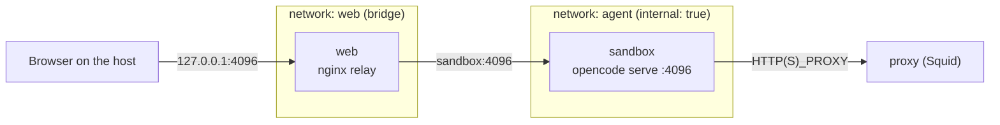

# Web mode

Instead of the terminal UI ([CLI usage](../README.md#cli-usage)), opencode can run as a server (`opencode serve`) and be used from a browser on the host, at <http://127.0.0.1:4096>.

## Usage

The `sandbox` container runs `opencode serve` as its main process ([opencode/scripts/entrypoint.sh](../opencode/scripts/entrypoint.sh)). Get the URL, user and password with [web-credentials](../opencode/scripts/web-credentials.sh):

```bash
docker compose exec sandbox web-credentials
# URL:      http://127.0.0.1:4096
# User:     opencode
# Password: ...
```

`web-credentials --password` prints the password alone, for a password manager or the clipboard (`docker compose exec -T sandbox web-credentials --password | xclip -selection clipboard`).

Open <http://127.0.0.1:4096> and log in. Projects are the repositories under `/home/ubuntu/workspace`. The terminal UI keeps working alongside (`docker compose exec sandbox opencode <repo>`).

## Enable or disable

Web mode is on by default. Set `OPENCODE_SERVER_ENABLED=0` (in `.env` or the environment) to disable it, then `docker compose up -d`: the `sandbox` container stays idle and only the terminal UI is available; the relay keeps running and answers `502 Bad Gateway`. Set it back to `1` (or remove it) to enable web mode again.

## Password

- **Generated by default**: on first start, a random password is written to `~/.config/opencode-sandbox/web-password` (`opencode-config` volume, mode 600). It is reused on later starts, so the browser can remember it. It is never printed to the container logs; read it with `web-credentials` or directly:

  ```bash
  docker compose exec sandbox cat /home/ubuntu/.config/opencode-sandbox/web-password
  ```
- **Chosen**: set `OPENCODE_SERVER_PASSWORD`, for example in a `.env` file next to [compose.yaml](../compose.yaml) (ignored by Git), then `docker compose up -d`. It takes precedence over the generated one.
- **Rotate** the generated password:

  ```bash
  docker compose exec sandbox sh -c 'rm ~/.config/opencode-sandbox/web-password'
  docker compose restart sandbox
  ```

## How it works

The `sandbox` container is only attached to the `internal` network `agent`, and Docker does not publish ports of containers on an internal network. The `web` service (official `nginx:alpine` image, configuration in [web/nginx.conf](../web/nginx.conf)) relays the host port to the sandbox:



- The relay only forwards inbound requests to `sandbox:4096`. Outbound traffic from the sandbox still goes through the Squid proxy and its allowlist; the relay does not give the sandbox a way out.
- The port is published on the host **loopback only** (`127.0.0.1:4096`): it is not reachable from other machines.
- The web UI is served by opencode itself; no extra domain is needed in [squid/allowed-domains.txt](../squid/allowed-domains.txt).
- The relay keeps WebSocket and server-sent events connections open (`proxy_buffering off`, long read timeout) for live session updates.

## Security

- **A password is always set.** Without one, opencode serves the UI and its API with no authentication: anyone or anything able to reach `127.0.0.1:4096` (other local users, a malicious web page through DNS rebinding…) could drive the agent, which is equivalent to a shell in the sandbox. This is why the entrypoint generates one when none is given.
- The password is **not printed to the container logs**, which may be collected by a logging driver or shared when reporting an issue. It is read on demand from the file (`web-credentials`), which requires `docker compose exec`: Docker access already grants more than the UI.
- The agent can read the password (process environment, file on the volume). It only protects access to the UI; do not reuse it elsewhere.
- Do not publish the port on other interfaces (`0.0.0.0:4096`). For remote access, use an SSH tunnel (`ssh -L 4096:127.0.0.1:4096 host`) or a reverse proxy with TLS and authentication in front.
- The server listens on `0.0.0.0` so the relay can reach it; this only exposes it on the `agent` network, where the relay and the proxy are the only other members.

