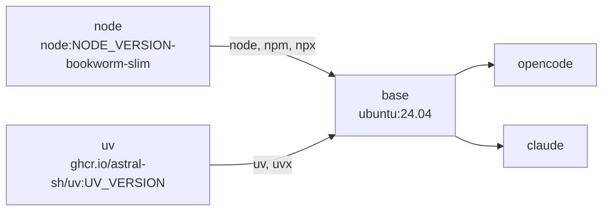

# sandbox image

Image of the `sandbox` service, built from [Dockerfile](Dockerfile). It is a multi-stage build with one final target per coding agent, selected in [compose.yaml](../compose.yaml) with `SANDBOX_IMAGE`.

## Stages



| Stage      | Role                                                                                                                                                         |
| ---------- | ------------------------------------------------------------------------------------------------------------------------------------------------------------ |
| `node`     | Source of the Node.js binary and the bundled `npm`/`npx`, copied into `base` (no NodeSource apt repository).                                                 |
| `uv`       | Source of the `uv` and `uvx` binaries, copied into `base` (no install script).                                                                               |
| `base`     | Tools shared by every agent, setup and web mode scripts, unprivileged user, volume mount points, entrypoint. Not meant to be run on its own.                 |
| `opencode` | Final target: [opencode](https://opencode.ai) CLI, `setup-albert`, web UI with `opencode serve`. Default.                                                    |
| `claude`   | Final target: [Claude Code](https://code.claude.com/docs/en/overview) CLI, web UI with [ttyd](https://github.com/tsl0922/ttyd).                              |

Adding another agent means adding a `FROM base AS <name>` target with a `sandbox-server` script, see [docs/portability.md](../docs/portability.md).

## Content

Common to both targets (`base`):

- Ubuntu 24.04 with `ca-certificates`, `curl`, `git`, `jq`, `python3`, `ripgrep`, `unzip`.
- `gh` from the official GitHub CLI apt repository.
- Node.js with `npm` and `npx`, for local MCP servers and `npx skills add`. Global `npm install -g` fails at runtime (`/usr/local` is owned by root): use `npx -y`.
- `uv` and `uvx` for Python tools, using the system `python3`.
- [code-server](https://github.com/coder/code-server) (VS Code in the browser), deb package from the GitHub releases, served with `SANDBOX_SERVER=vscode`, see [docs/vscode.md](../docs/vscode.md).
- No SSH client: repositories are cloned over HTTPS (port 22 is blocked by the proxy anyway).

| Target     | Agent install                                                                                   | Specific settings                                                                                                         |
| ---------- | ----------------------------------------------------------------------------------------------- | ------------------------------------------------------------------------------------------------------------------------- |
| `opencode` | Official install script, binary in `~/.opencode/bin` (in the image, outside the volumes)        | —                                                                                                                         |
| `claude`   | `npm install -g @anthropic-ai/claude-code` as root (the native installer writes to `~/.local`, hidden by the volume) | `CLAUDE_CONFIG_DIR=~/.config/claude` (kept on the config volume), `DISABLE_AUTOUPDATER=1` (rebuild to update) |

## Scripts

Copied from [scripts/](scripts/) to `/usr/local/bin`:

| Command              | Source                                                 | Targets    | Role                                                                                         |
| -------------------- | ------------------------------------------------------ | ---------- | -------------------------------------------------------------------------------------------- |
| `sandbox-entrypoint` | [entrypoint.sh](scripts/entrypoint.sh)                 | all        | `ENTRYPOINT`: resolves the web password, then runs `sandbox-server` (or `sandbox-server-vscode` if `SANDBOX_SERVER=vscode`), or stays idle if `SANDBOX_SERVER_ENABLED=0` |
| `sandbox-server`     | [server-opencode.sh](scripts/server-opencode.sh)       | `opencode` | `opencode serve` on `SANDBOX_SERVER_PORT`                                                    |
| `sandbox-server`     | [server-claude.sh](scripts/server-claude.sh)           | `claude`   | ttyd serving `claude`, one process per browser tab, repository given with `?arg=<repo>`      |
| `sandbox-server-vscode` | [server-vscode.sh](scripts/server-vscode.sh)        | all        | code-server on `SANDBOX_SERVER_PORT`, opening `~/workspace`                                  |
| `web-credentials`    | [web-credentials.sh](scripts/web-credentials.sh)       | all        | Prints the web UI URL, user and password                                                     |
| `setup-github`       | [setup-github.sh](scripts/setup-github.sh)             | all        | GitHub token for `gh` and `git`, see [docs/github.md](../docs/github.md)                     |
| `setup-albert`       | [setup-albert.sh](scripts/setup-albert.sh)             | `opencode` | Albert API provider for opencode, see [docs/model-provider.md](../docs/model-provider.md)    |

## User and volumes

The image runs as `ubuntu` (uid 1000), with `/home/ubuntu/workspace` as working directory. The mount points of the named volumes are created as `ubuntu` in the image, so that an empty volume mounted there inherits uid 1000 ownership:

| Path                     | Volume (compose)  |
| ------------------------ | ----------------- |
| `/home/ubuntu/workspace` | `opencode-data`   |
| `/home/ubuntu/.config`   | `opencode-config` |
| `/home/ubuntu/.local`    | `opencode-local`  |

Anything installed under these paths at build time is hidden once the volume is mounted: agents and tools are installed elsewhere (`/usr/local`, `~/.opencode`).

## Build arguments

| Argument              | Default  | Stage      | Effect                                                    |
| --------------------- | -------- | ---------- | --------------------------------------------------------- |
| `NODE_VERSION`        | `24`     | `node`     | Tag of the official `node` image (major version)          |
| `UV_VERSION`          | `latest` | `uv`       | Tag of the official `ghcr.io/astral-sh/uv` image          |
| `CODE_SERVER_VERSION` | latest   | `base`     | code-server release, e.g. `4.141.0`                       |
| `OPENCODE_VERSION`    | latest   | `opencode` | opencode release, e.g. `1.18.35`                          |
| `CLAUDE_CODE_VERSION` | latest   | `claude`   | `@anthropic-ai/claude-code` npm version, e.g. `2.1.295`   |

## Environment variables

Set by the image:

| Variable              | Value                         | Use                                              |
| --------------------- | ----------------------------- | ------------------------------------------------ |
| `SANDBOX_IMAGE`       | `opencode` or `claude`        | Read by the scripts (default web user, messages) |
| `CLAUDE_CONFIG_DIR`   | `/home/ubuntu/.config/claude` | `claude` only                                    |
| `DISABLE_AUTOUPDATER` | `1`                           | `claude` only                                    |

Read at runtime (set in [compose.yaml](../compose.yaml)): `SANDBOX_SERVER` (see [docs/vscode.md](../docs/vscode.md)), `SANDBOX_SERVER_ENABLED`, `SANDBOX_SERVER_USERNAME`, `SANDBOX_SERVER_PASSWORD`, `SANDBOX_SERVER_PORT` (default `4096`), see [docs/web-mode.md](../docs/web-mode.md); `HTTP(S)_PROXY`, `NO_PROXY` and `NODE_USE_ENV_PROXY`, see [docs/networking.md](../docs/networking.md).

## Build

Through Compose (recommended, the image is named `agent-sandbox-<target>`):

```bash
docker compose build sandbox
SANDBOX_IMAGE=claude docker compose build sandbox
docker compose build --no-cache --build-arg OPENCODE_VERSION=1.18.35 sandbox
```

Directly:

```bash
docker build --target opencode -t agent-sandbox-opencode sandbox
docker build --target claude -t agent-sandbox-claude sandbox
```

The build runs on the host network, outside the sandbox: it reaches Docker Hub, `ghcr.io`, the Ubuntu archive, `cli.github.com`, the code-server install script and its GitHub release, the opencode install script and its downloads, or `registry.npmjs.org` directly, whatever [squid/allowed-domains.txt](../squid/allowed-domains.txt) contains. The allowlist only applies to the running container.

> [!WARNING]
> Run outside of Compose, the image has no proxy and no isolated network: the agent gets direct Internet access. Use it through [compose.yaml](../compose.yaml).
